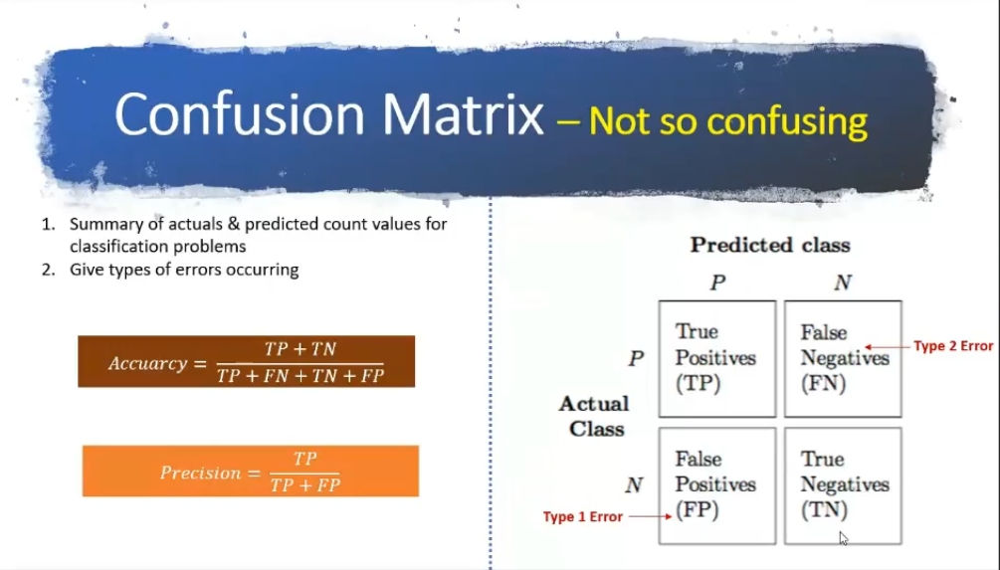
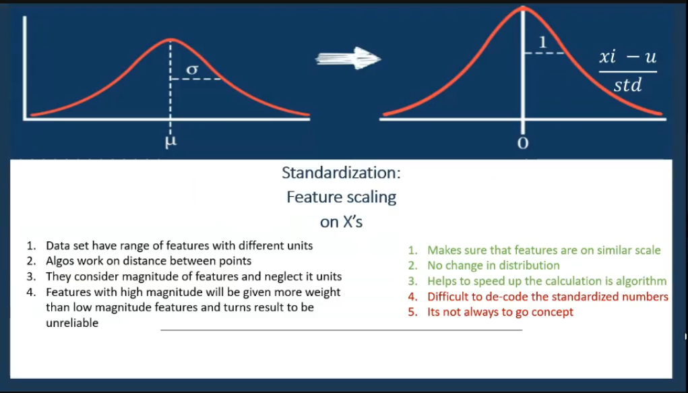

## Data Analysis and Visualisation to predict Mobile Price (0 = low cost, 1 = medium cost, 2 = high cost and 3 = very high cost)

In this project I'm trying to analyze and visualize the Output variable i.e Mobile Price Categories. There are multiple input feature such as Ram, Battery Power, pixel width and many more feature that helps in prediction.

## Data Description

    1) battery_power: mAh (Energy battery can store in one time)
    2) blue: Has Bluetooth or not
    3) clock_speed: Speed of microprocessor
    4) dua_sim: Support to dual sim or not
    5) fc: Front Camera mega pixels
    6)four_g: Has 4G or not
    7)int_memory: Internal Memory in Gigabytes
    8)m_dep: Mobile Depth in cm
    9)mobile_wt: Weight of mobile phone
    10)n_cores: Number of cores of processor
    11)pc: Primary Camera mega pixels
    12)px_height: Pixel Resolution Height
    13)px_width: Pixel Resolution Width
    14)ram: Random Access Memory in Mega Bytes
    15)sc_h: Screen Height of mobile in cm
    16)sc_w: Screen Width of mobile in cm
    17)talk_time: longest time that a single battery charge will last when you are
    18)three_g: Has 3G or not
    19)touch_screen: Has touch screen or not
    20)wifi: Has wifi or not
    21)price_range: This is the target variable with value of 0(low cost), 1(medium cost), 2(high cost) and 3(very high cost).

## Process

    1) Read the DataSet
    
    2) EDA
    
    3)check multicollinearity between input feature
    
    4)check relation between continous input feature and categorical output feature (Using Anova Test or Box Plot)
    
    5)check relation bewteen categorical input feature and categorical output feature (Using Chi-square Test)
    
    6)Build the Model
    
    7)Test the Model
    
    8)Evaluate the model
    
## Softwares and Libraries Used:

       - Anaconda Distribution
	- Jupyter Notebook
	
	- Numpy
	- Pandas
	- Matplotlib
	- Seaborn
    - sklearn 
    - statsmodels
    - warnings
    
## Importing the Modules:

    import pandas as pd
    import os as os
    import numpy as np

    #Visuals
    import matplotlib.pyplot as plt
    import seaborn as sns

    #Pre-processing
    from sklearn.preprocessing import StandardScaler
    from scipy.stats import chi2_contingency
    import scipy.stats as stats

    # To split data
    from sklearn.model_selection import train_test_split

    # Model Building
    from sklearn.ensemble import RandomForestClassifier
    from sklearn.neighbors import KNeighborsClassifier
    from sklearn.tree import DecisionTreeClassifier

    # Testing Model 
    from sklearn.metrics import accuracy_score
    from sklearn.metrics import confusion_matrix

    import warnings
    warnings.filterwarnings("ignore")
    
## Analysis:

1)Correlation Using HeatMap

2)Box Plot

3)Chi-Square Test

4)Decision Tree Analysis

5)Confusion Matrix Analysis:

6)Confusion of Decision Tree

7)Decision Tree:

## Decision Tree Accuarcy:
    
   Train = 76.9375
   
   Test = 73.5
  
8)Random Forest Analysis:

9)Radom Forest Confusion Matrix

10)Feature Importance using Random Forest:

## Random Forest Accuarcy:
    
   Train = 82
   
   Test = 77

11)KNN Analysis

11)Standardization for KNN

12)Confusion matrix for KNN

## KNN Accuarcy:
    
   Train = 91
   
   Test = 86
   
## Conclusing Statement

  We can conclude that from Above three algorithm KNN is most effective algorithm for mobile price prediction(classification) giving an train accuarcy of 91% and test accuracy   
  of 86%   
  
## Note

  You can also view the code in HTML format  
